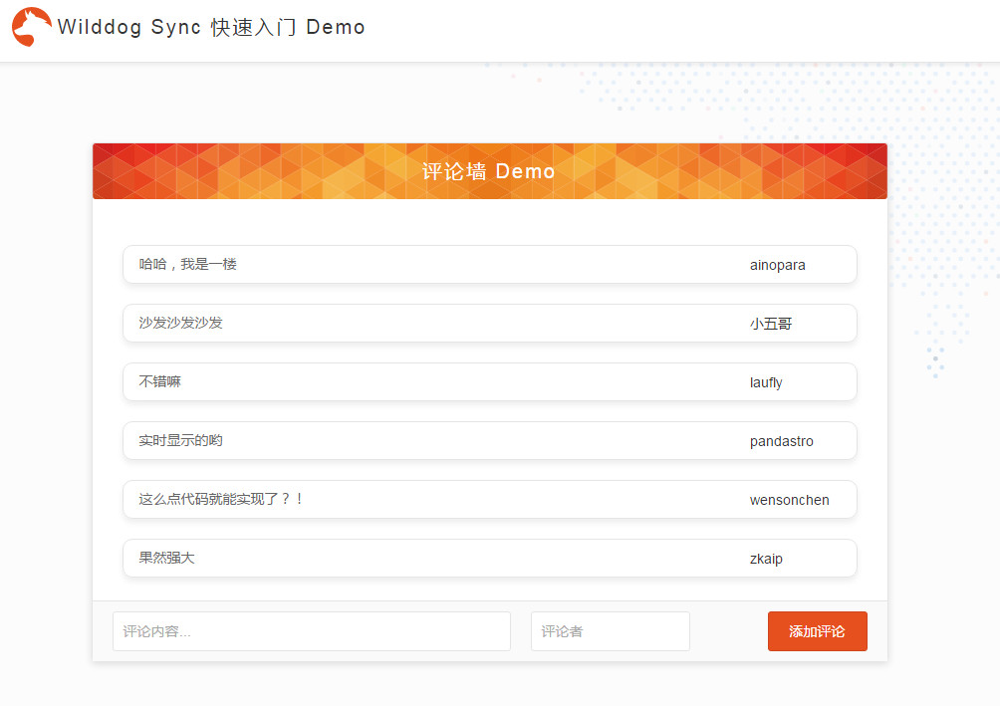

# Wilddog Sync 快速入门 Demo

此 Demo 实现了一个常见的**评论墙**的功能。效果如下：



## 本地运行

### nodejs 用户

执行以下命令：
```command
	git clone <git地址>

	npm install -g bower

	npm install 

	bower install
  
	npm install gulp -g

	gulp serve
```
正常情况下会自动在浏览器中打开 http://localhost:9000/ 。

### 非 nodejs 用户

打开 dist 目录，浏览器运行 index.html 文件即可。

## 替换成你的应用

此 Demo 使用的是野狗提供的示例应用，你可以在 [main.js](/app/scripts/main.js) 第四行处将示例应用替换成自己的应用。

替换成你自己的应用之后，可以在 [`控制面板-数据预览`](https://docs.wilddog.com/console/administer.html#数据预览) 中实时看到数据变化：


## 社区
如果遇到问题或有余力解答别人的问题可以到[野狗开发者社区](https://forum.wilddog.com) （**正在小规模测试**）
