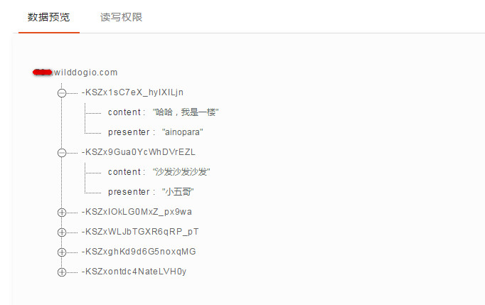

# Wilddog Sync 快速入门 Demo

此 Demo 实现了一个常见的**评论墙**的功能。效果如下：


## 本地运行

需要有 node.js 环境

然后执行以下命令：
```command
	git clone <git地址>

	npm install -g bower

	npm install 

	bower install

	gulp serve
```
正常情况下会自动在浏览器中打开 http://localhost:9000/ 。

## 替换成你的应用

此 Demo 使用的是示例野狗应用，你可以在 [此处](/app/scripts/main.js) 第四行替换成自己的应用。[如何创建应用？](https://docs.wilddog.com/console/creat.html)
使用你自己的应用，可以在 [`控制面板-数据预览`](https://docs.wilddog.com/console/administer.html#数据预览) 中实时看到数据变化：


